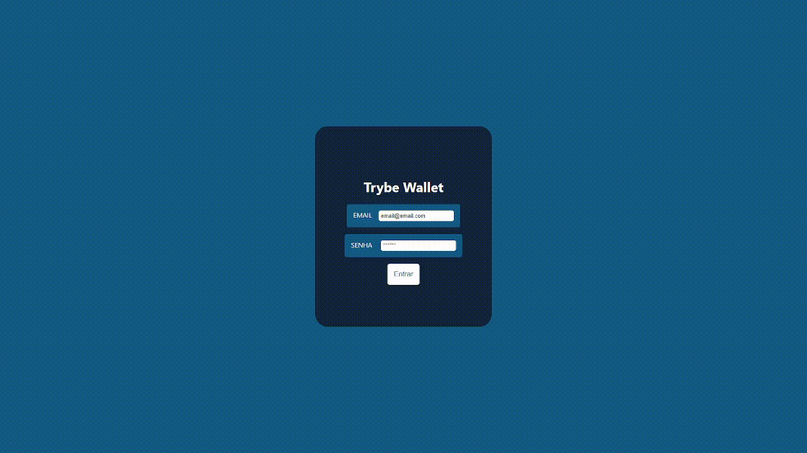

# Trybe Wallet

<!---Esses são exemplos. Veja https://shields.io para outras pessoas ou para personalizar este conjunto de escudos. Você pode querer incluir dependências, status do projeto e informações de licença aqui--->



> Aplicativo de controle de gastos e conversão de moedas.

## 💻 Detalhes do Projeto

Projeto desenvolvido durante o curso da Trybe. Este foi o 7º projeto do modúlo de front-end realizado dia 25/06/22, o desafio era desenvolver um página de controle de gastos e conversão de moedas. Foi usada uma API para conversão desenvolver a logica de conversão de moedas.
A pessoa usuária poderia acessar a aplicação com email e senha, adicionar despesas e posteriormente editar ou apagar as despesas.

## 🚀 Foram utilizadas as seguintes tecnologias:

<p align="left">
<a href="https://developer.mozilla.org/en-US/docs/Web/JavaScript" target="_blank" rel="noreferrer"></a>
<a href="https://developer.mozilla.org/en-US/docs/Glossary/HTML5" target="_blank" rel="noreferrer"></a>
<a href="https://www.w3.org/TR/CSS/#css" target="_blank" rel="noreferrer"></a>
<a href="https://reactjs.org/" target="_blank" rel="noreferrer"></a>
<a href="https://redux.js.org/" target="_blank" rel="noreferrer"></a>
</p>

## ☕ Usando o Trybe Wallet

Foi feito deploy desta aplicação,basta acessar o link abaixo: 

https://brntrybewallet.netlify.app

Ou então para utiliza-lá siga as intruções abaixo:

* Requer Node instalado na maquina versão 15+
* Fazer o clone do projeto
* Acessar a pasta do projeto
* Abrir o terminal na pasta do porjeto e instalar as dependências com o comando: 
```
npm install
```
* Após instalação das dependências poderá iniciar o projeto com o comando: 
```
npm start
```

[⬆ Voltar ao topo](#Trybe Wallet)<br>
